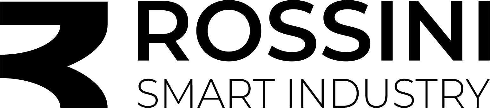

# Rossini-Smart-Industry
Soluzioni efficaci per la tua realtà. Sosteniamo le aziende nel loro percorso di trasformazione digitale ed energetica.
<!DOCTYPE html>
<html lang="it">
<head>
    <meta charset="UTF-8">
    <meta name="viewport" content="width=device-width, initial-scale=1.0, viewport-fit=cover">
    <title>Rossini - Smart Industry</title>
    
    <link rel="icon" type="image/png" href="img/Simbolo-rossini-b.png">
    <link rel="stylesheet" href="https://cdnjs.cloudflare.com/ajax/libs/font-awesome/6.4.0/css/all.min.css">
    <link href="https://fonts.googleapis.com/css2?family=Montserrat:wght@300;600;700;800&display=swap" rel="stylesheet">

    
</head>
<body>

    

        

            

            

        

    

    
    

    

        

            
            
P.IVA 04235680362

        

        

            

                <h1>SOLUZIONI EFFICACI PER LA TUA REALTÀ</h1>
                
Innovazione e tecnologia per l'industria smart

            

            

                
Contatto Diretto

                
Progettiamo e realizziamo la migliore soluzione su misura per la tua azienda industriale.

            

            

                

                    <i class="fas fa-phone"></i>TELEFONO
                

                

                    <i class="far fa-envelope"></i>EMAIL
                

                

                    <i class="far fa-envelope-open"></i>PEC
                

            

        

    

    

        

        

            
            
P.IVA 04235680362

        

        

            <h1>SOLUZIONI EFFICACI PER LA TUA REALTÀ</h1>
            
Innovazione e tecnologia

        

        

            
Contatto Diretto

            
Realizziamo la migliore soluzione per la tua azienda

        

        

            
contattami

            

                

                    

                    <i class="fas fa-phone"></i> TELEFONO
                

                

                    

                    <i class="far fa-envelope"></i> EMAIL
                

                

                    

                    <i class="far fa-envelope-open"></i> PEC
                

            

        

    

    

        
<i class="fas fa-times"></i>

        

            

                

                
<i id="overlay-icon"></i>

            

        

    

    
</body>
</html>
